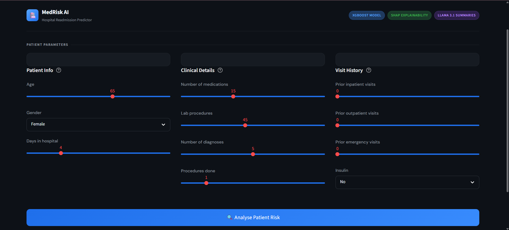
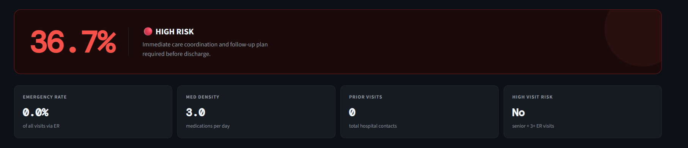
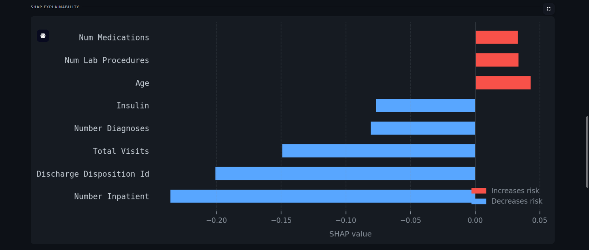

# 🏥 Hospital Readmission Risk Predictor

> AI-powered 30-day readmission risk assessment with SHAP explainability and LLM-generated clinical summaries — built on 98,053 real patient records.

[](https://hospital-readmission-predictor-efmi.onrender.com)
[](https://python.org)
[](https://xgboost.readthedocs.io)
[](https://streamlit.io)

---

## 📌 Problem Statement

Hospital readmissions cost the US healthcare system **$26 billion per year**. Diabetic patients are among the highest-risk groups. This project predicts which patients are at risk of readmission within 30 days — and explains exactly why — so doctors can intervene before discharge.

---

## 🖥️ Live Demo

**👉 [Try the app here](https://hospital-readmission-predictor-efmi.onrender.com/)**

> Note: App may take 30 seconds to load on first visit (free tier sleep mode)

### Screenshots

<!-- INSTRUCTIONS: Replace these with your actual screenshots -->
<!-- To add screenshots:
     1. Take screenshots of your running app
     2. Create a folder called "screenshots" in your project
     3. Put your images there (e.g. screenshots/dashboard.png)
     4. Replace the paths below with your actual image paths -->

| Dashboard | Risk Assessment | SHAP Chart |
|-----------|----------------|------------|
|  |  |  |


---

## 🧠 How It Works

```
Patient Data Input
      ↓
XGBoost Model (trained on 98K patients)
      ↓
Risk Score (0–100%)
      ↓
SHAP Explainability (why was this patient flagged?)
      ↓
LLaMA 3.1 via Groq API (doctor-ready clinical summary)
      ↓
Streamlit Dashboard (live prediction + history table)
```

---

## ⚙️ Tech Stack

| Layer | Technology | Purpose |
|-------|-----------|---------|
| ML Model | XGBoost | Predict readmission risk |
| Explainability | SHAP TreeExplainer | Explain each prediction |
| AI Summaries | LLaMA 3.1 via Groq API | Generate clinical summaries |
| Dashboard | Streamlit | Interactive web interface |
| Data Storage | AWS S3 | Store dataset and model |
| Dataset | UCI Diabetes 130-US | 98,053 real patient records |
| Deployment | Render.com | Free cloud hosting |

---

## 🔬 Feature Engineering

6 new features were engineered from raw clinical data — 3 of which became top SHAP predictors:

| Feature | Formula | Why It Matters |
|---------|---------|----------------|
| `total_visits` | inpatient + outpatient + emergency | Overall hospital contact — #3 SHAP predictor |
| `emergency_rate` | emergency / (total_visits + 1) | % of visits via ER — top 5 SHAP predictor |
| `medication_density` | medications / (days + 1) | Medications per hospital day — top 10 SHAP |
| `is_senior` | age >= 65 → 1 else 0 | Seniors have 12.5% higher readmission rate |
| `high_visit_risk` | senior AND emergency >= 3 | 2.2x baseline readmission rate (24.2% vs 11.2%) |
| `diagnosis_count` | count of filled diag columns | Complexity of patient condition |

---

## 📊 Model Performance

| Metric | Score |
|--------|-------|
| ROC-AUC | 0.6653 |
| High-risk patients caught | 1,097 / 2,213 |
| Training data | 78,442 patients |
| Test data | 19,611 patients |
| Best round (early stopping) | Round 243 |

> ROC-AUC of 0.6653 is consistent with published research benchmarks on this dataset (range: 0.63–0.70)

---

## ✨ Key Features of the App

- **Risk Score** — 0 to 100% readmission probability with HIGH / MODERATE / LOW classification
- **SHAP Chart** — horizontal bar chart showing top 8 features driving the prediction (red = increases risk, blue = decreases risk)
- **AI Clinical Summary** — LLaMA 3.1 generates a 3-sentence doctor-ready summary with one actionable recommendation
- **4 Metric Tiles** — emergency rate, medication density, total visits, high visit risk flag
- **Prediction History** — table showing last 6 predictions for patient comparison
- **Dark theme UI** — professional design with DM Sans + DM Mono fonts

---

## 🗂️ Project Structure

```
hospital-readmission-predictor/
│
├── app.py                    # Main Streamlit application
├── requirements.txt          # Python dependencies
├── setup.sh                  # Render deployment config
├── Procfile                  # Render start command
├── README.md                 # This file
│
├── notebooks/
│   ├── 01_EDA_cleaning.ipynb     # Data cleaning + feature engineering
│   ├── 02_model_training.ipynb   # XGBoost training + SHAP analysis
│   ├── shap_summary.png          # SHAP feature importance chart
│   ├── shap_waterfall.png        # Single patient SHAP explanation
│   └── confusion_matrix.png      # Model evaluation chart
│
├── models/
│   ├── xgboost_readmission.pkl   # Trained XGBoost model
│   └── feature_names.json        # Feature names for prediction
│
└── screenshots/
    ├── dashboard.png
    ├── risk.png
    └── shap.png
```

---

## 🚀 Run Locally

```bash
# 1. Clone the repository
git clone https://github.com/Monalika04/hospital-readmission-predictor.git
cd hospital-readmission-predictor

# 2. Install dependencies
pip install -r requirements.txt

# 3. Add your Groq API key
echo "GROQ_API_KEY=your_key_here" > .env

# 4. Run the app
streamlit run app.py
```

---

## 📁 Dataset

- **Source:** [UCI Diabetes 130-US Hospitals Dataset](https://www.kaggle.com/datasets/jimschacko/airlines-dataset-to-predict-a-delay)
- **Size:** 101,766 records → 98,053 after cleaning
- **Features:** 50 original → 48 after cleaning + 6 engineered
- **Target:** `readmitted` — whether patient was readmitted within 30 days

---

## 💡 What I Learned

- End-to-end ML pipeline from raw data to deployed app
- Feature engineering for healthcare data
- Handling class imbalance with `scale_pos_weight`
- SHAP explainability for black-box models
- LLM integration via Groq API for clinical NLP
- Cloud deployment on Render.com

---

## 👩‍💻 Author

**Monalika Pingale**
- GitHub: [@Monalika04](https://github.com/Monalika04)
- LinkedIn: [Add your LinkedIn URL here]

---

## ⭐ If you found this project useful, please give it a star!